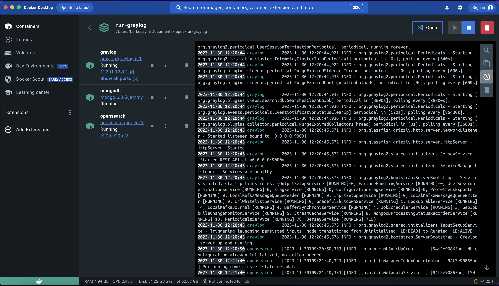
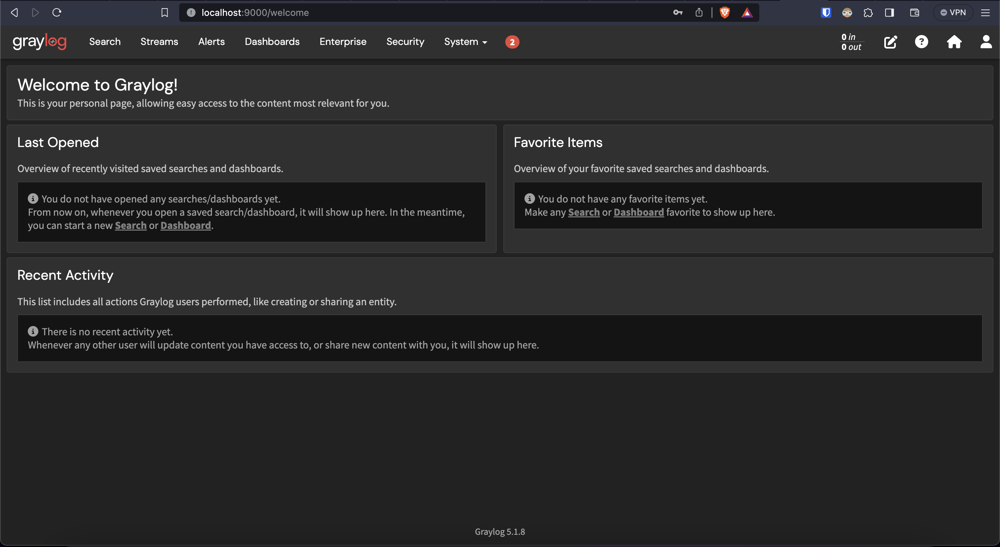

# Run Graylog Server With Docker

This repository is created to run `Graylog Server` with `Docker Compose` using `containers`.

### Usage

```bash
git clone https://github.com/berkesayin/run-graylog.git
```

or just copy `docker-compose.yml` file somewhere to use with the command below.

```
docker-compose up
```

- Access `Graylog Server` [here.](http://localhost:9000)

#### Screenshots

Docker Desktop after running `docker-compose.yml`. You can also check containers with `docker ps`



Graylog Server Login Screen


Graylog Server Home Screen


